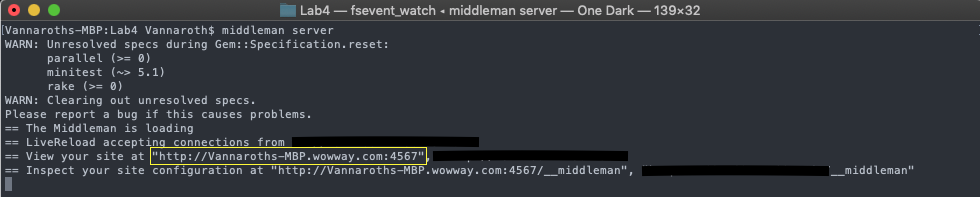

## Game of Set

## DESCRIPTION:
Implements the Game of Set in Javascript which runs on a single-paged site.

## SETUP:
1.) Change directory to the "Game of Set" directory in the terminal

2.) Run "bundler install" in the "Game of Set" directory

3.) Run "bundle exec middleman server" (to exit: 'ctrl+c')

4.) Copy the generated url in the yellow box

5.) Paste and search the copied URL in a browser of your choice

Note: Save files are saved to the downloads folder on the user's machine
